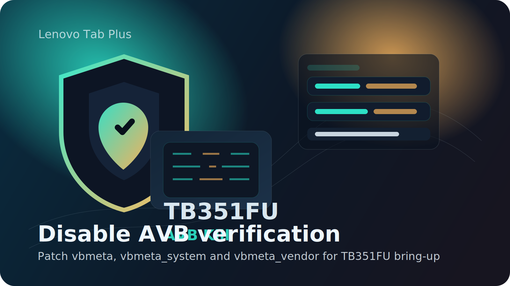

<p align="center">
  
</p>

<h1 align="center">TB351FU AVB Kill</h1>

<p align="center">
  Open-source tools for patching and flashing <code>vbmeta</code>,
  <code>vbmeta_system</code>, and <code>vbmeta_vendor</code> on the Lenovo Tab Plus
  <code>TB351FU</code> when AVB and verification checks block modified partitions.
</p>

<p align="center">
  <strong>TB351FU only</strong> • <strong>AVB / dm-verity workflow</strong> • <strong>Fastboot flashing</strong>
</p>

> [!WARNING]
> This repository changes Android Verified Boot behavior on the Lenovo Tab Plus `TB351FU`.
> Flashing the wrong images, using mismatched firmware, or skipping backups can leave the
> device unbootable. Use it only if you understand the risks.

> [!NOTE]
> This repository does not distribute Lenovo firmware. You must provide your own stock
> `vbmeta` images from firmware that matches your device build.

## What This Repository Does

On `TB351FU`, AVB can block boot when you start modifying partitions for custom recovery,
root, kernel changes, or other bring-up work. This repo provides:

- `patch_vbmeta.py` to patch the three required AVB-related images
- `install.sh` to flash the patched outputs over fastboot on Linux
- a simple standalone workflow that keeps Lenovo-proprietary firmware files out of the repo

The patcher edits the AVB flag field inside each supplied image so verification and dm-verity
checks can be disabled for the patched outputs.

## Repository Contents

| Path | Purpose |
| --- | --- |
| `patch_vbmeta.py` | Patches the three stock AVB images |
| `install.sh` | Fastboot flasher for the patched outputs |
| `assets/readme-banner.svg` | README banner artwork |

## Required Input Files

Place these stock files in the repository root before running the patcher:

| File | Why it is needed |
| --- | --- |
| `vbmeta.img` | Main AVB metadata image |
| `vbmeta_system.img` | System AVB metadata image |
| `vbmeta_vendor.img` | Vendor AVB metadata image |

These files must come from firmware that matches the tablet you are working on.

## Output Files

After a successful patch run, the script generates:

- `vbmeta_disabled.bin`
- `vbmeta_system_disabled.bin`
- `vbmeta_vendor_disabled.bin`

These are the files flashed by `install.sh`.

## How The Workflow Works

1. Copy the three stock AVB images into the repository root.
2. Run the Python patcher.
3. Reboot the tablet to fastboot mode.
4. Flash the patched outputs.
5. Erase `metadata` so the changed security state is reset cleanly.

## Quick Start

### 1. Patch the AVB images

```bash
python3 patch_vbmeta.py
```

The script looks for the stock images in the current repository folder and writes the patched
outputs in the same location.

### 2. Boot the tablet into fastboot

From power-off on `TB351FU`:

- Hold `Volume Down` + `Power`

### 3. Flash the patched outputs

If you are on Linux and already have `fastboot` installed:

```bash
chmod +x install.sh
./install.sh
```

`install.sh` checks for `fastboot` before flashing and stops if platform-tools are not available.

## Manual Flash Commands

If you prefer to flash manually, use:

```bash
fastboot --disable-verity --disable-verification flash vbmeta vbmeta_disabled.bin
fastboot --disable-verity --disable-verification flash vbmeta_system vbmeta_system_disabled.bin
fastboot --disable-verity --disable-verification flash vbmeta_vendor vbmeta_vendor_disabled.bin
fastboot erase metadata
fastboot reboot
```

## Why `metadata` Is Erased

After changing AVB-related images, erasing `metadata` helps clear the old verification state so
the device can rebuild it with the patched vbmeta configuration.

## Typical Use Cases

- bootloader-unlocked testing
- TWRP or recovery bring-up
- kernel or ramdisk modifications
- rooting or patched boot flows
- situations where AVB verification blocks boot after partition changes

## Limitations

- This repository is intended for the Lenovo Tab Plus `TB351FU` only.
- It assumes you already have correct stock `vbmeta` images.
- It does not include Windows automation; Windows users should use the manual fastboot commands.
- Disabling verification is useful for development, but it reduces the normal verified-boot safety checks.

## Safety Notes

- Back up anything important before flashing.
- Keep copies of your original stock images.
- Do not mix files from unrelated firmware packages.
- If the tablet is in a bad state already, return to stock firmware before testing patched AVB images.

## Related Projects

- [TB351FU Dev Hub](https://helllopratik.github.io/tb351fu/)
- [lenovo_tb351fu_bootloader_unlock](https://github.com/helllopratik/lenovo_tb351fu_bootloader_unlock)
- [lenovo_flash_xml_helper_TB351FU](https://github.com/helllopratik/lenovo_flash_xml_helper_TB351FU)

## Acknowledgements
 - Maintainer: `Pratik Gondane (@helllopratik)`
 - Device: `Lenovo Tab Plus (2024) TB351FU`

## License

The Python patcher, shell script, and README assets in this repository are open-source and free
to share under the repository license.
